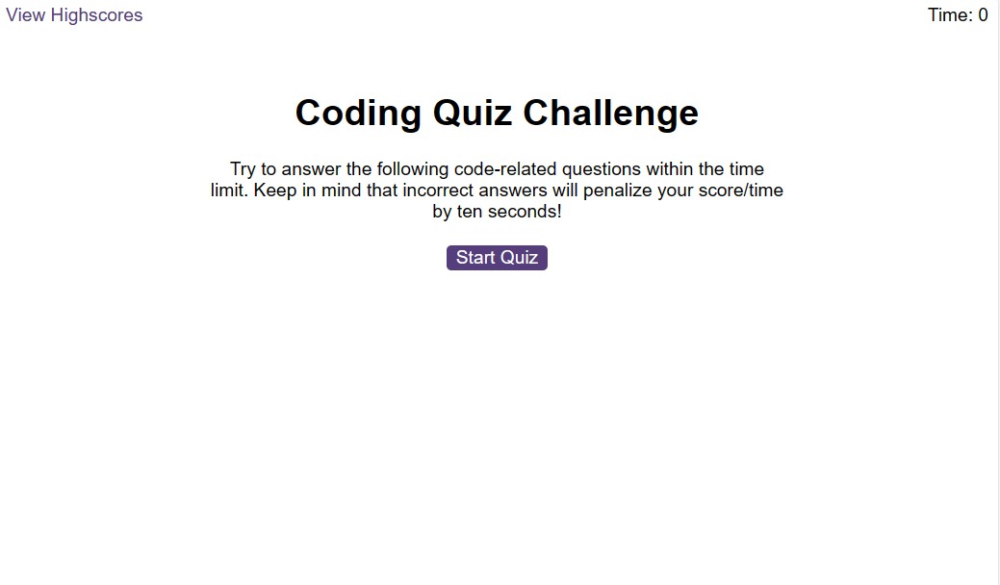
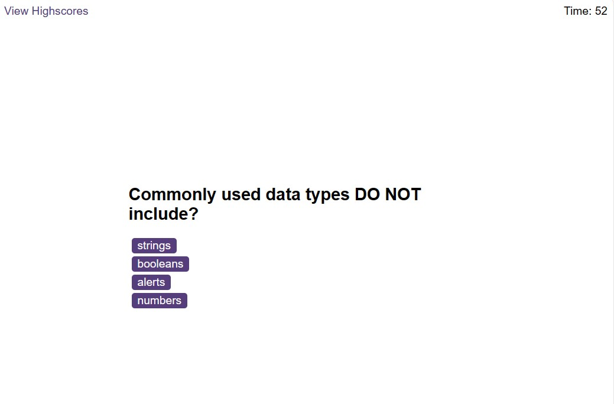
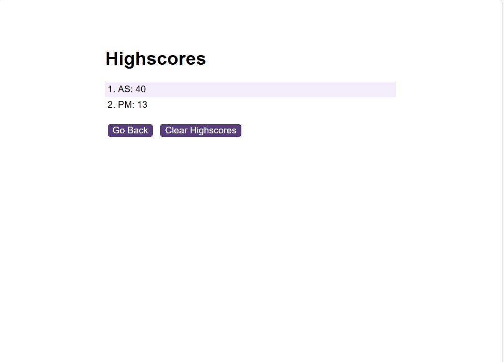

# JS-Code-Quiz

## Description

The aim of this project is to create a quiz that records your score and displays it in a high score table. The table can be cleared and/or the quiz can be taken again.

The website can be viewed [here](https://duouk2000.github.io/JS-Code-Quiz)

## Installation

NA

## Usage

Click on the 'Start Quiz' button to generate the first question. A timer will begin counting down from 60. If you answer the question correctly, a sound will play to confirm this and the next question will be generated. If you answer the question incorrectly, a sound will play to confirm you have answered the question incorrectly and 10 seconds will be deducted from the timer. When you reach the end of the game, your remaining time is your score. You are prompted to input your initials which are saved in a highscore table along with your score.

The highscore table can be cleared and you can also retake the test.

## Screenshot
 
 

    
## Credits

- Websites used to review and test javascript commands & tutorials - [w3schools](https://www.w3schools.com/html/default.asp) /
[MDN Web Docs](https://developer.mozilla.org/en-US/docs/Learn/HTML)

- Websites reviewed to help generate a badge - [Shields.io](https://shields.io/badges) & [lukas-h github](https://gist.github.com/lukas-h/2a5d00690736b4c3a7ba)

## License

MIT License

Copyright (c) 2024 Andrew Sinkinson

Permission is hereby granted, free of charge, to any person obtaining a copy of this software and associated documentation files (the “Software”), to deal in the Software without restriction, including without limitation the rights to use, copy, modify, merge, publish, distribute, sublicense, and/or sell copies of the Software, and to permit persons to whom the Software is furnished to do so, subject to the following conditions:

The above copyright notice and this permission notice shall be included in all copies or substantial portions of the Software.

THE SOFTWARE IS PROVIDED “AS IS”, WITHOUT WARRANTY OF ANY KIND, EXPRESS OR IMPLIED, INCLUDING BUT NOT LIMITED TO THE WARRANTIES OF MERCHANTABILITY, FITNESS FOR A PARTICULAR PURPOSE AND NONINFRINGEMENT. IN NO EVENT SHALL THE AUTHORS OR COPYRIGHT HOLDERS BE LIABLE FOR ANY CLAIM, DAMAGES OR OTHER LIABILITY, WHETHER IN AN ACTION OF CONTRACT, TORT OR OTHERWISE, ARISING FROM, OUT OF OR IN CONNECTION WITH THE SOFTWARE OR THE USE OR OTHER DEALINGS IN THE SOFTWARE.

## Badges

